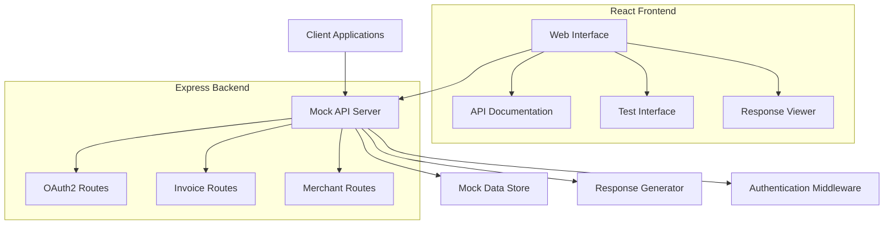

# Design Document

## Overview

The Dewu MOCK API application will be a React-based web application that provides mock implementations of the Dewu platform APIs. The application will serve both as a mock API server and provide a web interface for testing and documentation. It will use Express.js as the backend server with React for the frontend interface.

## Architecture

### High-Level Architecture



### Technology Stack

- **Frontend**: React 18+ with TypeScript
- **Backend**: Express.js with TypeScript
- **HTTP Client**: Axios for API calls
- **Styling**: CSS Modules or Styled Components
- **Development**: Vite for build tooling
- **Mock Data**: JSON files for configurable responses

## Components and Interfaces

### Backend Components

#### 1. Express Server (`src/server/app.ts`)
- Main application server
- Middleware setup (CORS, JSON parsing, logging)
- Route registration
- Error handling

#### 2. OAuth2 Controller (`src/server/controllers/oauth2Controller.ts`)
- Handles token generation endpoint
- Handles token refresh endpoint
- Validates request parameters
- Generates mock tokens with realistic format

#### 3. Invoice Controller (`src/server/controllers/invoiceController.ts`)
- Handles invoice list retrieval
- Handles invoice processing
- Validates access tokens
- Returns mock invoice data

#### 4. Merchant Controller (`src/server/controllers/merchantController.ts`)
- Handles merchant info retrieval
- Validates access tokens
- Returns mock merchant data

#### 5. Authentication Middleware (`src/server/middleware/auth.ts`)
- Validates access tokens for protected endpoints
- Handles token expiration logic
- Returns appropriate error responses

#### 6. Mock Data Manager (`src/server/utils/mockData.ts`)
- Manages mock response data
- Supports configuration-based responses
- Generates realistic mock data

### Frontend Components

#### 1. App Component (`src/components/App.tsx`)
- Main application layout
- Navigation between different sections
- Global state management

#### 2. API Documentation (`src/components/ApiDocs.tsx`)
- Displays available endpoints
- Shows request/response formats
- Interactive documentation

#### 3. Test Interface (`src/components/TestInterface.tsx`)
- Forms for testing each endpoint
- Request builder with parameter inputs
- Response display area

#### 4. Endpoint Card (`src/components/EndpointCard.tsx`)
- Individual endpoint information
- Request format display
- Sample response examples

## Data Models

### OAuth2 Token Response
```typescript
interface TokenResponse {
  code: number;
  msg: string;
  data: {
    scope: string[];
    open_id: string;
    access_token: string;
    access_token_expires_in: number;
    refresh_token: string;
    refresh_token_expires_in: number;
  };
  status: number;
}
```

### Invoice Data
```typescript
interface InvoiceItem {
  invoice_title: string;
  seller_reject_reason: string;
  verify_time: string;
  category_type: number;
  order_time: string;
  invoice_image_url: string;
  bank_name: string;
  invoice_type: number;
  company_address: string;
  article_number: string;
  bidding_price: number;
  spu_id: number;
  invoice_title_type: number;
  spu_title: string;
  bank_account: string;
  status: number;
  upload_time: string;
  apply_time: string;
  company_phone: string;
  handle_flag: number;
  amount: number;
  seller_post: {
    express_no: string;
    take_end_time: string;
    sender_name: string;
    take_start_time: string;
    logistics_name: string;
    sender_full_address: string;
  };
  sku_id: number;
  reject_time: string;
  order_no: string;
  properties: string;
  tax_number: string;
  reject_reason: string;
  seller_post_appointment: boolean;
}

interface InvoiceListRequest {
  app_key: string;
  access_token: string;
  timestamp: number;
  sign: string;
  page_no: number;
  page_size: number;
  spu_id?: number;
  status?: number;
  order_no?: string;
  apply_start_time?: string;
  apply_end_time?: string;
  invoice_title_type?: number;
}

interface InvoiceListResponse {
  trace_id: string;
  msg: string;
  code: number;
  data: {
    page_no: number;
    page_size: number;
    total_results: number;
    list: InvoiceItem[];
  };
}

interface InvoiceHandleRequest {
  app_key: string;
  access_token: string;
  timestamp: number;
  sign: string;
  order_no: string;
  image_key?: string;
  category_type: number;
  reject_operation?: number;
  operation_type: number;
}

interface InvoiceHandleResponse {
  trace_id: string;
  msg: string;
  code: number;
  data: {};
}
```

### Merchant Info
```typescript
interface MerchantInfoRequest {
  app_key: string;
  access_token: string;
  timestamp: number;
  sign: string;
}

interface MerchantInfoResponse {
  domain: string;
  code: number;
  msg: string;
  data: {
    merchant_id: string;
    type_id: string;
  };
  errors: Array<{
    name: string;
    message: string;
  }>;
}
```

## API Endpoints Design

### 1. OAuth2 Token Generation
- **Endpoint**: `POST /api/v1/h5/passport/v1/oauth2/token`
- **Request**: JSON with client_id, client_secret, authorization_code
- **Response**: TokenResponse with mock access_token and refresh_token
- **Validation**: Required fields, format validation

### 2. Token Refresh
- **Endpoint**: `POST /api/v1/h5/passport/v1/oauth2/refresh_token`
- **Request**: JSON with client_id, client_secret, refresh_token
- **Response**: Updated TokenResponse
- **Validation**: Refresh token validity check

### 3. Invoice List
- **Endpoint**: `POST /dop/api/v1/invoice/list`
- **Request**: JSON with app_key, access_token, timestamp, sign, page_no, page_size, and optional filters
- **Response**: InvoiceListResponse with paginated invoice data including detailed invoice items
- **Authentication**: Access token validation
- **Signature**: Request signature validation required

### 4. Invoice Handle
- **Endpoint**: `POST /dop/api/v1/invoice/handle`
- **Request**: JSON with app_key, access_token, timestamp, sign, order_no, operation_type, category_type, and optional image_key/reject_operation
- **Response**: InvoiceHandleResponse with success/error status
- **Authentication**: Access token validation
- **Signature**: Request signature validation required

### 5. Merchant Base Info
- **Endpoint**: `POST /dop/api/v1/common/merchant/base/info`
- **Request**: JSON with app_key, access_token, timestamp, sign
- **Response**: MerchantInfoResponse with merchant_id and type_id
- **Authentication**: Access token validation
- **Signature**: Request signature validation required

## Error Handling

### Error Response Format
```typescript
interface ErrorResponse {
  code: number;
  msg: string;
  data?: any;
  status: number;
}
```

### Common Error Codes
- `400`: Bad Request - Invalid parameters
- `401`: Unauthorized - Missing or invalid access token
- `403`: Forbidden - Token expired or insufficient permissions
- `404`: Not Found - Endpoint not found
- `500`: Internal Server Error - Server processing error

## Testing Strategy

### Unit Testing
- Test individual controller functions
- Test middleware functionality
- Test mock data generation
- Test request validation logic

### Integration Testing
- Test complete API endpoint flows
- Test authentication middleware integration
- Test error handling across endpoints

### Frontend Testing
- Test React component rendering
- Test API call integration
- Test user interaction flows
- Test response display functionality

### Manual Testing
- Use the built-in web interface for manual testing
- Test with external HTTP clients (Postman, curl)
- Verify response formats match specification
- Test error scenarios and edge cases

## Configuration

### Environment Variables
```
PORT=3000
NODE_ENV=development
CORS_ORIGIN=*
LOG_LEVEL=info
MOCK_DATA_PATH=./src/data
```

### Mock Data Configuration
- JSON files for different response scenarios
- Configurable token expiration times
- Customizable merchant and invoice data
- Environment-specific response variations

## Deployment Considerations

### Development
- Hot reload for both frontend and backend
- Separate dev servers for frontend and API
- Mock data easily modifiable during development

### Production
- Single build output with static frontend
- Express server serves both API and static files
- Environment-based configuration
- Docker containerization support